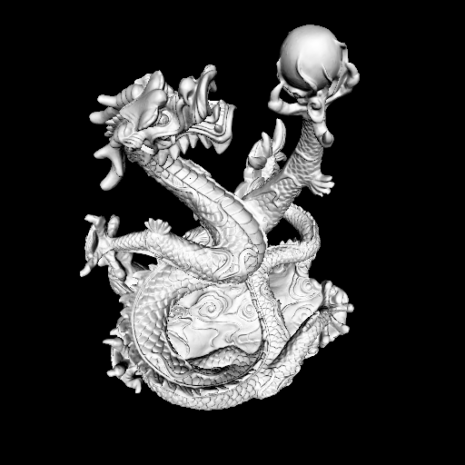
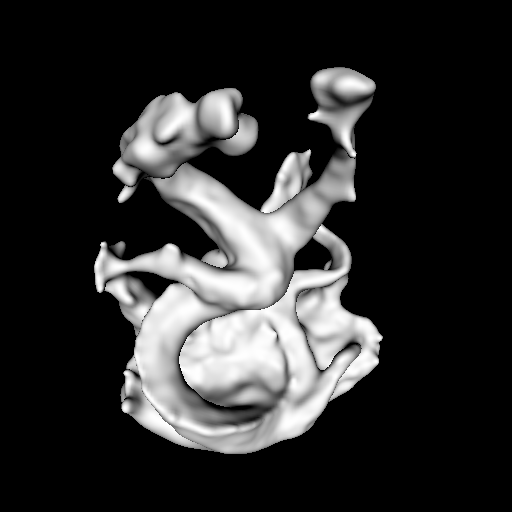
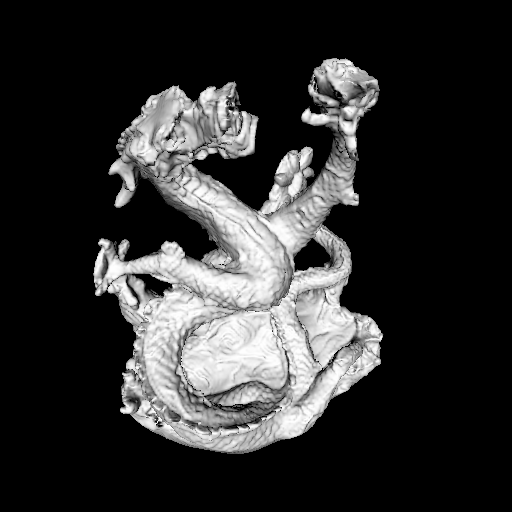

# Refining Multi-view 3D Reconstruction with Differentiable rendering

This is the source code for my Master thesis where I worked on exploring the possibilities offered by differentiable
rendering to refine results of exisiting 3D reconstruction methods. The full text of the thesis is available as pdf [here](https://github.com/SRaimondi/DRDemo/blob/master/thesis.pdf).

Below you can see an example of a target view for the pearl dragon mesh, the initial rendering of the output of [SMVS](https://github.com/flanggut/smvs) and the final
reconstruction after applying our method.

You can see how the details lost from SMVS due to regularisation are recovered in our method.

